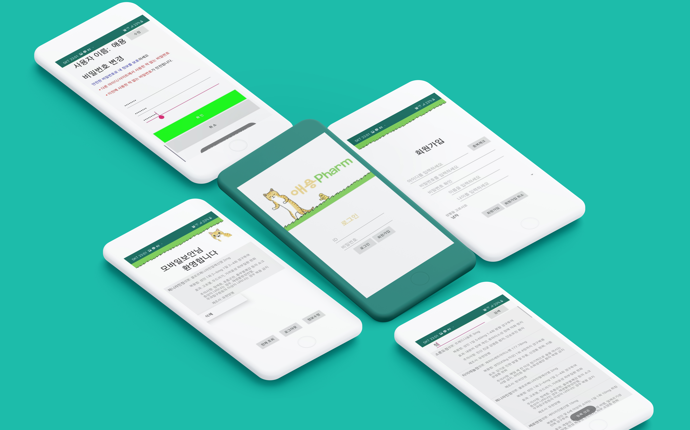
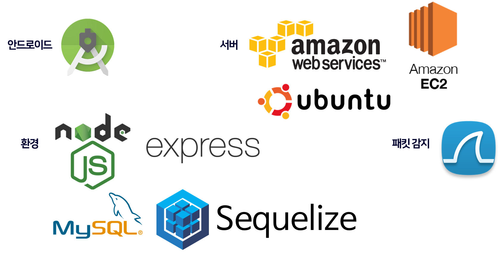
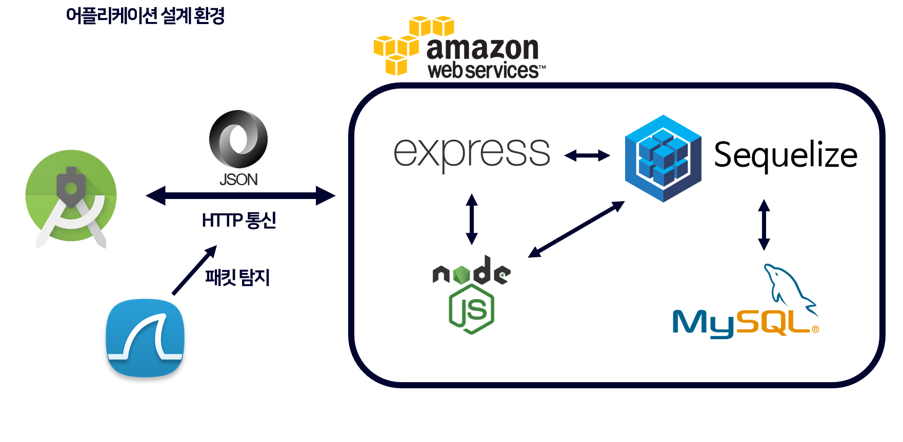
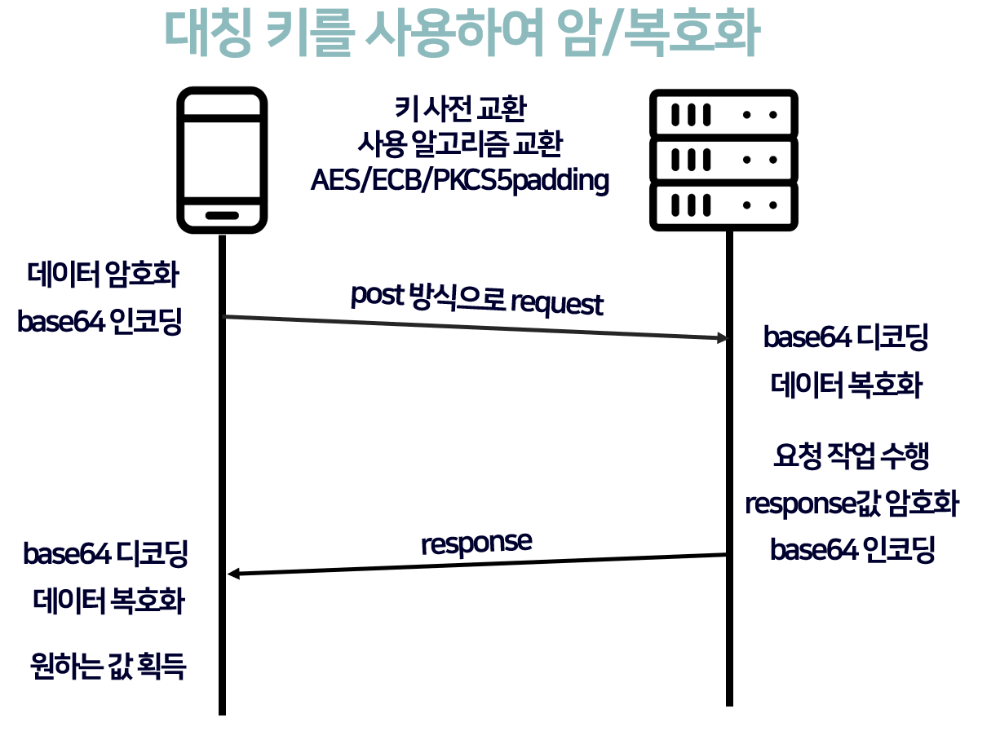
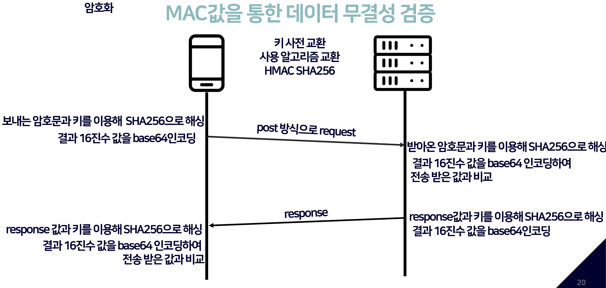

# 🔎사용자의 복용 약 정보를 관리해주는 안드로이드 애플리케이션 - 애용팜(Pharm)

### 개요

* 사용자가 민감하다고 느낄 수 있는 복용 약 정보와 개인정보등을 암호화하여 웹 서버와 통신

### 개발 목적

* HTTPS를 사용하지 않고, 암호화 알고리즘만을 이용하여 패킷이 양단 간 암호화되어 전송되는 안드로이드 애플리케이션

### 개발 기간
* 2019.03~2019.06

### 개발 인원
* [송은주](https://github.com/OctopusSwellfish)
* [안현진](https://github.com/HyeonJinGitHub)

### 설계 환경
* **서버** : AWS EC2, NodeJS, express
* **데이터베이스** : MySQL, Sequelize
* **안드로이드** : JAVA
* **패킷 탐지** : WireShark

### 흐름도

### 구현 기능

* 회원 가입
* 로그인
* 약 DB조회
* 약 DB검색
* 복용 약 추가
* 복용 약 삭제
* 회원 정보 수정

### 암호화

* 대칭 키를 사용하여 암/복호화

  * AES/ECB/PKCS5padding 적용

    

* 데이터 무결성 검증

  * HMAC SHA256 적용

    

### 성과

* Codemind 기준 보안 취약점 0개 달성
* 과목 팀 프로젝트 최우수 평가 달성